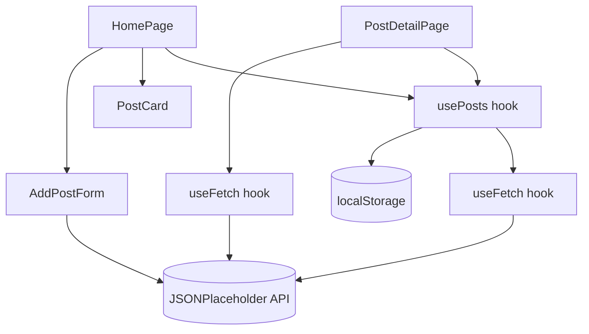

# FastFetch

A React app that fetches posts and comments from the [JSONPlaceholder](https://jsonplaceholder.typicode.com/) API, built as a take-home assessment.

## Running locally

Requires Node.js 20.19+ or 22.12+.

```bash
npm install
npm run dev
```

Then open the URL Vite prints in the terminal (defaults to `http://localhost:5173`).

## Features implemented

- **Display posts** — fetches all posts from `/posts` and renders them as cards showing title and body.
- **Post details** — clicking a post navigates to `/posts/:id`, which fetches and displays the full post plus its comments (from `/comments?postId={id}`) in a list.
- **Search** — a search bar on the main page filters posts by title, client-side, as you type, with an autocomplete dropdown of matching titles.
- **Add a new post** — a form (title + body) that `POST`s to `/posts` and adds the result to the top of the list.
- **Styling** — Tailwind CSS, responsive down to mobile widths, with a light/dark theme toggle.

## Architecture



- **Pages** (`src/pages/`) — `HomePage` and `PostDetailPage` render the screens and use hooks for data.
- **`usePosts`** (`src/hooks/`) is the single source of truth for the post list — it fetches posts, merges in locally-added ones, filters out deleted ones, numbers them, and reads/writes `localStorage`. Both pages use it, so they always stay in sync.
- **`useFetch`** (`src/hooks/`) is a small generic hook (`{ data, loading, error }`) any component can use to GET data — used directly for comments, and internally by `usePosts`.
- **Components** (`src/components/`) — `PostCard`, `PostCarousel`, `AddPostForm`, `ThemeToggle` are small, reusable, and do no data-fetching of their own.

## Additional features beyond the spec

- **Light/dark theme toggle**, persisted in `localStorage`.
- **Delete a post** — every post (including ones fetched from the API) can be deleted from the UI. Since JSONPlaceholder is a mock API and doesn't actually persist changes, deletions are tracked client-side (a list of deleted ids in `localStorage`) and filtered out on render. This is client-only: it doesn't affect the real API or other devices/browsers.
- **Locally-added posts persist** across page reloads via `localStorage`, and are numbered consistently between the post list and its detail page.
- **Carousel** on the post list (6 posts per page, with page dots) instead of rendering all 100 at once.

## Known limitations

- Because JSONPlaceholder doesn't persist writes, newly added or "deleted" posts only exist in your browser's `localStorage` — they aren't visible to anyone else and won't survive clearing site data.
